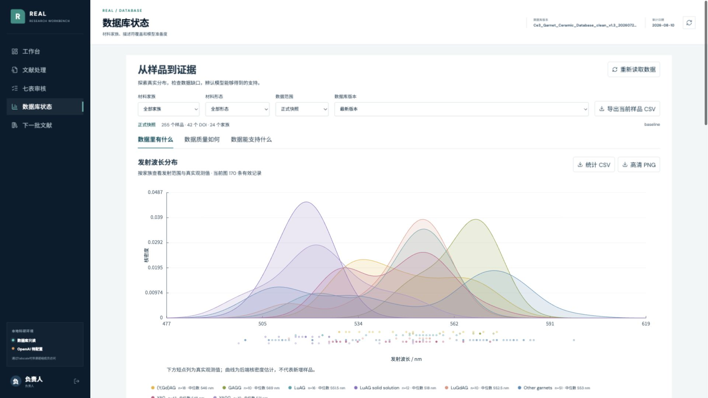
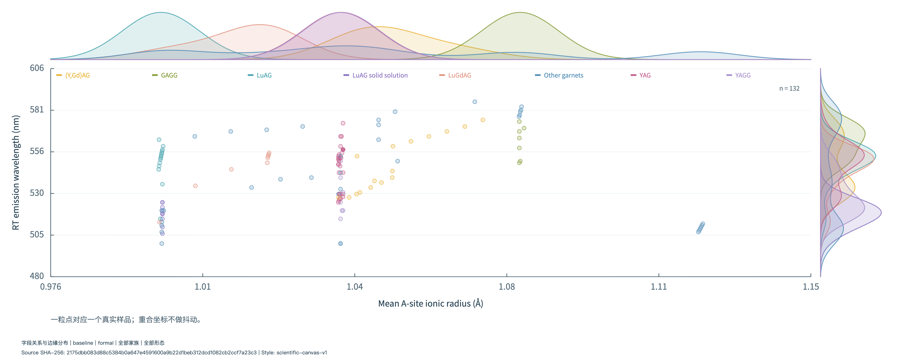
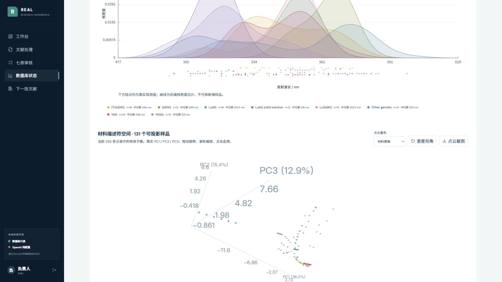

# REAL 交互科研图验收

验收日期：2026-09-12 至 2026-09-13。两个独立工作树：REAL前端工作树与科研主库 `codex/real-database-figures`。未合并/推送至GitHub主分支。

## 真实页面与导出

网页运行在 `http://127.0.0.1:5173/real-materials-showcase/workbench#database`；后端8000端口。PNG为网页同一Canvas绘制函数的4200像素输出，不是生成式图像模型编造的数据图。

## 已核对

- 全库255记录、42 DOI、24原始host标签；当前图有效值：分布170、联合散点132、点云131。核心132／27 DOI／19汇报家族与全库不是同一范围。
- LuAG筛选：16记录、5 DOI；分布16、联合散点14、点云14，同步更新。
- 实际浏览器中拖动后，点云视角改变。重合样品不抖动，样品表可查；选中样品跨图高亮且不重置相机。
- 21项前端测试，39项后端测试，14项科研绘图/统计测试通过。构建和lint通过；Three.js按需模块仍有体积提示，不阻塞构建。
- 跨仓库测试使用一次性合成夹具，不污染真实数据库。新审核发布版本增加1条测试核心样品，分布/联合散点/点云均改变，来源哈希改变；baseline统计和原工作簿字节不变。
- 发布要求完整校验及负责人审核均匹配同一包哈希。修改后重新校验不等于重新审核；旧审核不能发布新内容。候选发布是整包，确认框显示筛选内和整包行数。
- 失败保留上一版本，图集资源、来源、代码哈希校验；并发发布/绘图受到保护。
- 权威Excel SHA-256仍为 `4e943dbed899f242bd71d0323f9569098b3de5dd3f20daa81d542ca6686b407f`；STATUS、DECISIONS和训练快照无修改。

## 尚未声称完成

- 当前本地后端未配置OpenAI Key，未执行新的付费论文蒸馏；上传、DOI确认、七表入口保留，待本地配置后逐篇确认调用。
- 没有把未审核真实候选发布成新正式科研数据，也未声称本轮新增真实样品。
- 缺组成描述符的记录不会生成假3D坐标；完整组成精确匹配且向量一致时复用组成描述符，否则保持缺口。M0/M1指标不随可视化刷新改变。
- 母版只锁定点线审美，不复制其虚构带隙趋势或散点密度。

建议记忆更新：暂不写入STATUS/DECISIONS；待真实论文蒸馏与负责人发布完成后，再确认正式协作入口。
